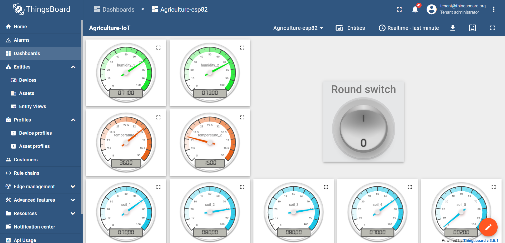

# Smart Greenhouse

The smart greenhouse is the final project of the Industrial Automation course at the Ferdowsi University of Mashhad.

### Overview

This project is an IoT-based project implemented on esp32 and esp8266 boards and various sensors.
In this project, we collect the telemetry data related to a greenhouse and send them to IoT platforms like thingsboard. The sensor's data are observed in real-time and if they exceed the predefined threshold, an alert will arise.

